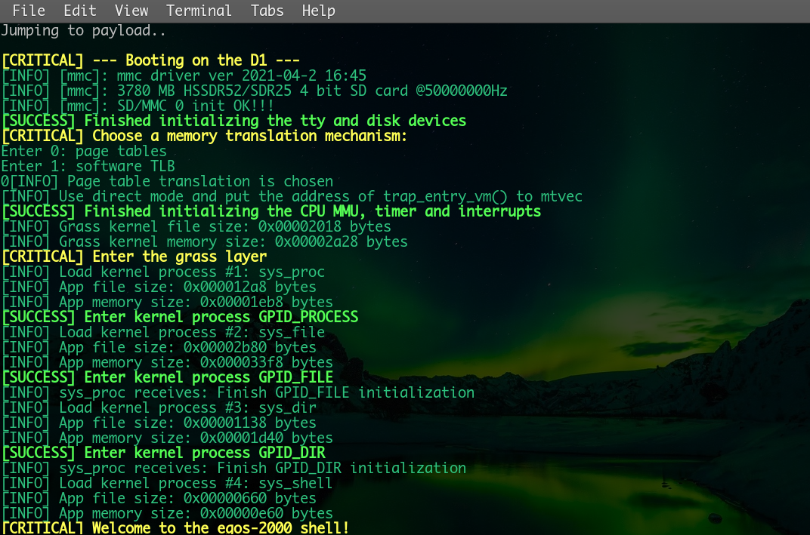

## About

This is a port of the awesome [egos-2000](https://github.com/yhzhang0128/egos-2000/) teaching operating system to Allwinner's D1 chip, using Sipeed's [Lichee RV](https://wiki.sipeed.com/hardware/en/lichee/RV/RV.html) compute module.

There is no attempt at staying under 2K lines of code. Most of the chip dependent sources were gotten from [FlatHeadBro's D1 baremetal programs](https://github.com/Ouyancheng/FlatHeadBro) (to whom I am immensely grateful) and given a facelift.

The port either runs in M-mode, or M+S+U with Page Tables.

### Usages and Documentation

For compiling and running egos-2000-d1, please read [this document](references/USAGES.md).
The [RISC-V instruction set manual](references/riscv-privileged-v1.10.pdf), [C906 processor manual](references/XuanTie-OpenC906-UserManual.pdf) and [D1 chip manual](references/D1_User_Manual_V0.1_Draft_Version.pdf) introduce the privileged ISA and memory map. [egos.h](library/egos.h) details the memory layout

### Major Changes
- New memory layout in [egos.h](library/egos.h) and linker scripts
- New disk layout in [disk.h](library/file/disk.h)
- [fence.i](earth/cpu_mmu.c#L80) required after a context switch when running in M-mode only.
- D1 C906 Sv39 [paging](earth/cpu_mmu.c#L83)
- [trap_entry_vm](earth/earth.s#L96) rewrite to allow for clearing `mstatus.MPRV` before `mret`, which the D1 doesn't do.
- Toggle `mstatus.MPRV` in [timer_reset](earth/cpu_timer.c#L38) to allow requesting timer interrupts.
- [Enable](earth/earth.c#L59) `mcounteren.TM` to allow reading `time` csr in S-mode

#### TODO
- Mem paging
- User-level threading